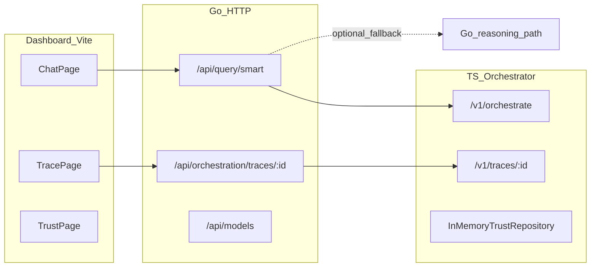

# GAIOL coordinator roadmap (build-only)

## Architecture anchor (from code)

**Implication:** Trust data exists in the orchestrator process but there is no documented `GET /v1/trust` (or Go proxy) yet—plan milestones to add a read API and same-origin access before the trust dashboard can be real.

---

## Sequencing principles

1. **Earliest usable product:** local runbook + hardened shell + **Chat → smart query → visible answer + trace id → trace viewer** beats polishing secondary pages.
2. **Endpoint before UI:** any page that calls an API schedules backend/glue first unless the UI can mock until the contract exists.
3. **Parallelism:** After **Shell-Hardening** and **Local-Run-Glue**, *Trust-Read-API* (backend) can run in parallel with *Smart-Chat-UI* (frontend) by different agents—different subsystems.

---

## Milestones (complete list)

- **Milestone:** Local-Run-Glue  
- **Area:** glue  
- **Done looks like:**  
  - Documented steps to run Go API, TS orchestrator, and dashboard dev server together (ports, required env vars e.g. TS delegate flags).  
  - `/health` on Go (and TS) verified for dashboard/CORS expectations.  
  - Clear note on auth modes (`AUTH_DISABLED` vs JWT) and how the dashboard obtains credentials.  
  - Single command or script optional but reproducible sequence is mandatory.
- **ETA:** 0.5 day  
- **Implementer:** Cursor Agent  
- **Depends on:** none  
- **Milestone:** Shell-Hardening  
- **Area:** frontend  
- **Done looks like:**  
  - Layout, routing, and navigation stable for all primary routes (`/chat`, `/trace/:id`, `/trust`, `/models`, `/metrics`, `/history`, `/settings`, `/eval`).  
  - Global theming and spacing consistent; toast/notification pattern usable app-wide.  
  - Central configuration for API base URL and error display convention (no page-specific ad-hoc fetch scattered without pattern).
- **ETA:** 1 day  
- **Implementer:** Cursor Agent  
- **Depends on:** Local-Run-Glue  
- **Milestone:** Smart-Chat-UI  
- **Area:** frontend  
- **Done looks like:**  
  - Chat page performs `POST /api/query/smart` with prompt, task, strategy, token/temperature controls aligned with [API.md](API.md).  
  - Success and error states are clear; loading state does not lose user input.  
  - When the response includes orchestration metadata (trace id / session id per actual JSON shape from Go+TS path), the UI surfaces it and links to the trace route.
- **ETA:** 1–1.5 days  
- **Implementer:** Cursor Agent  
- **Depends on:** Shell-Hardening  
- **Milestone:** Trace-Viewer-UI  
- **Area:** frontend  
- **Done looks like:**  
  - Trace page loads `GET /api/orchestration/traces/:id` (Go proxy to TS) and renders trace, rebuilt timeline, and `metrics_summary` in a readable structure.  
  - Handles 404/503 with actionable messaging (orchestrator down, unknown id).  
  - Works when opened from Chat deep link and when `/trace/:id` is visited directly.
- **ETA:** 1–1.5 days  
- **Implementer:** Cursor Agent  
- **Depends on:** Smart-Chat-UI (for product coherence; endpoint can be validated earlier)  
- **Milestone:** Trust-Read-API  
- **Area:** backend  
- **Done looks like:**  
  - TS orchestrator exposes a stable read endpoint for ABTC trust state (e.g. list by domain / model identifiers—shape documented).  
  - Contract matches what a dashboard needs (scores, deltas, domain, model id, last updated if available).  
  - Basic tests or manual verification checklist for empty vs populated store.
- **ETA:** 0.5–1 day  
- **Implementer:** Cursor Agent  
- **Depends on:** none (parallel after Local-Run-Glue)  
- **Milestone:** Trust-API-Proxy  
- **Area:** glue  
- **Done looks like:**  
  - Browser can call Go-origin URL(s) that forward to the TS trust read API (same pattern as [internal/httpserver/register.go](internal/httpserver/register.go) trace proxy), avoiding CORS split-brain.  
  - Auth behavior consistent with other proxied routes (auth disabled vs JWT).  
  - Documented path(s)—aligned with product expectation of `/v1/trust` on TS and a Go `/api/...` proxy for the UI if that is the single origin.
- **ETA:** 0.5 day  
- **Implementer:** Cursor Agent  
- **Depends on:** Trust-Read-API  
- **Milestone:** Trust-Dashboard-UI  
- **Area:** frontend  
- **Done looks like:**  
  - Trust page consumes the Go-proxied trust API and visualizes heatmap/table per domain and model.  
  - Refresh and empty-state behavior defined.  
  - Links or cross-hints to trace viewer where trust rounds exist in a trace (if trace payload includes trust rounds).
- **ETA:** 1 day  
- **Implementer:** Cursor Agent  
- **Depends on:** Trust-API-Proxy, Shell-Hardening  
- **Milestone:** Models-Inspector-UI  
- **Area:** frontend  
- **Done looks like:**  
  - Models page uses `GET /api/models` (and related discovery endpoints if needed) with search/filter and capability tags.  
  - Shows how models participate in routing at a high level (read-only inspector, not necessarily editing router weights unless API exists).  
  - From a trace id (when known), user can correlate model ids shown in trace with registry entries (manual paste or navigation from Trace viewer).
- **ETA:** 1 day  
- **Implementer:** Cursor Agent  
- **Depends on:** Shell-Hardening  
- **Milestone:** Metrics-Dashboard-MVP  
- **Area:** frontend  
- **Done looks like:**  
  - Metrics page displays `metrics_summary` for at least one trace (user supplies id or picks from in-session list).  
  - Charts or summary cards for latency, cost, success, beam, trust movement as present in payload.
- **ETA:** 1 day  
- **Implementer:** Cursor Agent  
- **Depends on:** Trace-Viewer-UI  
- **Milestone:** Metrics-MultiTrace-Backend  
- **Area:** backend  
- **Done looks like:**  
  - Either durable trace index/list API or agreed MVP storage so Metrics can show trends across recent runs (not only in-memory TS process).  
  - Documented retention limits and privacy/tenant boundaries if auth is on.
- **ETA:** 1–2 days  
- **Implementer:** Cursor Agent  
- **Depends on:** Metrics-Dashboard-MVP (validates required fields) or parallel if product accepts list endpoint first  
- **Milestone:** Settings-Orchestration-UI  
- **Area:** frontend  
- **Done looks like:**  
  - Settings page wires existing provider keys / tenant model settings APIs from Go where they already exist.  
  - User-facing controls for consensus defaults, beam width, budgets: **either** bound to existing preference/settings endpoints **or** clearly scoped as “server env” with read-only display until a config API exists.  
  - No dead forms: every control maps to a real API or explicit “requires deployment config” label.
- **ETA:** 1–1.5 days  
- **Implementer:** Cursor Agent  
- **Depends on:** Shell-Hardening  
- **Milestone:** Orchestration-Runtime-Config-API  
- **Area:** backend  
- **Done looks like:**  
  - Optional: tenant-safe API to adjust orchestration parameters currently driven only by env (only if Settings milestone requires mutability).  
  - Validation, defaults, and audit/logging hooks defined.
- **ETA:** 1–2 days  
- **Implementer:** Cursor Agent  
- **Depends on:** Settings-Orchestration-UI (to define required surface)  
- **Milestone:** Eval-HTTP-Surface  
- **Area:** backend  
- **Done looks like:**  
  - HTTP endpoints (TS or Go) that run or report results from the existing evaluation harness in [orchestrator/src/evaluation/](orchestrator/src/evaluation/) (today largely in-process).  
  - Request/response contract documented for the UI.
- **ETA:** 1–1.5 days  
- **Implementer:** Cursor Agent  
- **Depends on:** Local-Run-Glue  
- **Milestone:** Eval-Runner-UI  
- **Area:** frontend  
- **Done looks like:**  
  - Eval page triggers runs via Eval-HTTP-Surface, shows progress and results summary.  
  - Errors from provider/orchestrator surfaced clearly.
- **ETA:** 1 day  
- **Implementer:** Cursor Agent  
- **Depends on:** Eval-HTTP-Surface, Shell-Hardening  
- **Milestone:** History-Activity-UI  
- **Area:** frontend  
- **Done looks like:**  
  - History page wired to the best existing Go APIs for user/tenant activity and/or reasoning session history (per actual handlers—e.g. activity/billing/history where applicable).  
  - Clear distinction between legacy reasoning sessions and TS orchestration traces if both exist.
- **ETA:** 1 day  
- **Implementer:** Cursor Agent  
- **Depends on:** Shell-Hardening  
- **Milestone:** Feature-Flags-And-Config-Docs  
- **Area:** glue  
- **Done looks like:**  
  - Documented feature flags / env vars for TS delegation, consensus mode, beam width, etc., and how they affect UI behavior.  
  - Health/readiness story for “orchestrator optional” vs required.
- **ETA:** 0.5 day  
- **Implementer:** Cursor Agent  
- **Depends on:** Local-Run-Glue  
- **Milestone:** Deploy-Minimal  
- **Area:** glue  
- **Done looks like:**  
  - Minimal repeatable deploy path (e.g. Dockerfile or compose including Go + TS + static dashboard build) **or** CI-friendly build scripts for each artifact.  
  - Environment variable template for production-like runs.
- **ETA:** 1–2 days  
- **Implementer:** Cursor Agent  
- **Depends on:** Local-Run-Glue

---

## Suggested default order (critical path)

`Local-Run-Glue` → `Shell-Hardening` → `Smart-Chat-UI` → `Trace-Viewer-UI` → `Metrics-Dashboard-MVP` → (`Trust-Read-API` → `Trust-API-Proxy` → `Trust-Dashboard-UI`) and `Models-Inspector-UI` in parallel where staffing allows → `Settings-Orchestration-UI` → `Eval-HTTP-Surface` → `Eval-Runner-UI` → `History-Activity-UI` → `Metrics-MultiTrace-Backend` (when trends are required) → `Orchestration-Runtime-Config-API` (only if settings need mutability) → `Feature-Flags-And-Config-Docs` + `Deploy-Minimal`.

---

## Coordinator usage (reminder)

- When you send `**completed: [milestone name]`**, the coordinator will mark it done, recompute unblockers, output the **next 3** milestones with rationale and preconditions, and give the exact handoff line for a Cursor Agent.  
- When you send `**update: [change]`**, the coordinator will revise sequencing and next three.
- **Spawn / status / parallel:** On `spawn: [subsystem]`, emit the first milestone prompt in `---CURSOR PROMPT START---` format. On `status`, emit the subsystem table. On `parallel: [a,b]`, confirm non-overlapping primary paths (see spawn note below).

---

## Phase 1: Subsystems and subagent plans

**Dependency rules (hard):** Backend Orchestrator supplies contracts before feature UIs; Frontend Shell before all feature pages; Chat UI before Trace Viewer (trace IDs in product flow); Backend before ABTC trust surface and metrics list APIs; Integration coordinates proxies/docs/CORS with Backend when Go `register.go` or TS `server.ts` change.

### 1. Backend Orchestrator

- **Subagent role:** Own Go HTTP handlers and TS Fastify orchestrator: `/api/query/smart` delegation, `/v1/orchestrate`, `/v1/traces/:id`, future trust read, eval HTTP, optional trace index.
- **Milestones:**
  1. **BO.M1** — Inventory and freeze JSON contracts for smart-query and orchestration responses consumed by Chat/Trace (no UI).
  2. **BO.M2** — TS: expose read-only trust snapshot HTTP API from existing trust repository.
  3. **BO.M3** — Go: proxy trust API same-origin for dashboard; auth parity with trace proxy.
  4. **BO.M4** — HTTP surface for evaluation harness (TS or Go), documented request/response.
  5. **BO.M5** (optional) — Trace list or persistence hook for multi-run metrics.
- **Depends on subsystems:** none (root). Integration reviews proxies.

### 2. Frontend Shell

- **Subagent role:** App shell: layout, routing, global state, theme, shared notifications/errors, API base configuration.
- **Milestones:**
  1. **FS.M1** — Routes and navigation for all primary pages; empty/skeleton states.
  2. **FS.M2** — Theme tokens and global styles consistent across pages.
  3. **FS.M3** — Shared API client setup (base URL, credentials, error shape).
  4. **FS.M4** — Toast/banner pattern and optional error boundary.
- **Depends on subsystems:** Integration (documented env/base URL); Backend not required for static shell.

### 3. Chat UI

- **Subagent role:** Chat/query experience against `POST /api/query/smart`.
- **Milestones:**
  1. **CH.M1** — Prompt submit, loading, display final answer text.
  2. **CH.M2** — Task/strategy/token/temp controls aligned with API contract.
  3. **CH.M3** — Surface trace/session id from response and link to `/trace/:id`.
- **Depends on subsystems:** Frontend Shell (FS.M3 minimum); Backend Orchestrator (BO.M1 for contract).

### 4. Trace Viewer

- **Subagent role:** Orchestration trace visualization via `GET /api/orchestration/traces/:id`.
- **Milestones:**
  1. **TV.M1** — Fetch bundle; structured layout for `trace`, `timeline_rebuilt`, `metrics_summary`.
  2. **TV.M2** — Timeline UX (expand/collapse, ordering, key events).
  3. **TV.M3** — Error states (404/503) and “orchestrator unavailable” copy.
- **Depends on subsystems:** Frontend Shell (FS.M3); Chat UI (CH.M3) for intended UX; Backend already exposes trace proxy.

### 5. ABTC Dashboard

- **Subagent role:** Trust heatmap/table and model registry/inspector (discovery + correlation with traces).
- **Milestones:**
  1. **AB.M1** — Models page: `GET /api/models` list/filter/capabilities.
  2. **AB.M2** — Trust page: consume Go-proxied trust read API; empty and refresh behavior.
  3. **AB.M3** — Cross-link: from trace payload model ids to registry rows (navigation or copy-friendly ids).
- **Depends on subsystems:** Frontend Shell; Backend BO.M2–M3 for trust; Trace Viewer helpful for AB.M3.

### 6. Metrics

- **Subagent role:** Metrics dashboard from `metrics_summary` / trace data; evaluation runner **UI** (harness HTTP owned by Backend BO.M4).
- **Milestones:**
  1. **ME.M1** — Metrics page: input trace id, fetch bundle, show summary cards.
  2. **ME.M2** — Deeper charts/tables for latency/cost/trust fields present in payload.
  3. **ME.M3** — Eval runner UI calling eval HTTP surface; result summary display.
  4. **ME.M4** (optional) — Multi-trace trends when BO.M5 exists.
- **Depends on subsystems:** Frontend Shell; Trace Viewer (ME.M1 can reuse fetch pattern); Backend BO.M4 for ME.M3; BO.M5 for ME.M4.

### 7. Settings

- **Subagent role:** Provider keys, tenant models, preferences, honest labeling for env-only orchestration knobs.
- **Milestones:**
  1. **SE.M1** — Wire provider keys and custom providers flows to existing Go settings APIs.
  2. **SE.M2** — Tenant models / preferences where APIs exist.
  3. **SE.M3** — Orchestration/consensus/budget UI: editable only if API exists; otherwise read-only + docs link.
- **Depends on subsystems:** Frontend Shell; Backend (existing routes; optional BO future config API).

### 8. Integration

- **Subagent role:** Glue: local dev matrix, CORS, Go↔TS proxies, `API.md` / contract sync with implementation.
- **Milestones:**
  1. **IN.M1** — Runbook: Go + TS + dashboard ports, env vars, auth modes, health checks.
  2. **IN.M2** — Verify and patch CORS/proxy paths for each new UI-facing endpoint (coordinate with Backend).
  3. **IN.M3** — Single-source API documentation updated after contract changes.
- **Depends on subsystems:** Reads all; **file conflict risk** with Backend on `register.go` / proxy handlers — sequence IN.M2 after Backend lands or pair in one agent.

### 9. Docs

- **Subagent role:** Developer and operator documentation; demo narratives/scripts.
- **Milestones:**
  1. **DO.M1** — Quickstart aligned with IN.M1.
  2. **DO.M2** — Dashboard feature map (which page calls which endpoint).
  3. **DO.M3** — Demo script: chat → trace → trust/models path.
- **Depends on subsystems:** Integration IN.M1; feature pages as they land.

### 10. Ops

- **Subagent role:** Deployment artifacts, health/readiness, minimal observability conventions.
- **Milestones:**
  1. **OP.M1** — Health/readiness story (Go + TS); document failure modes for UI.
  2. **OP.M2** — Minimal deploy: compose or Dockerfiles for three artifacts or CI build scripts.
  3. **OP.M3** — Logging/monitoring checklist (no vendor lock; fields and probes).
- **Depends on subsystems:** Integration IN.M1.

### Spawn-first recommendation (parallel, low file conflict)

1. **Backend Orchestrator — BO.M1** (contract inventory; touches docs + maybe read-only code).
2. **Frontend Shell — FS.M1** (`dashboard/` layout/routes only).
3. **Integration — IN.M1** (runbook: `docs/` / `scripts/`; avoid `register.go` until IN.M2).

**Avoid parallelizing** Backend BO.M3 with Integration IN.M2 on the same sprint without coordination (both may touch Go registration/proxies).

